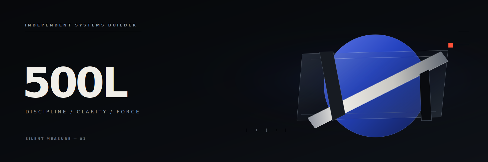
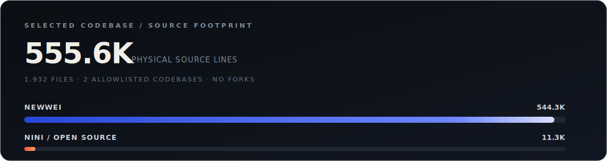

  

  <code>AI SYSTEMS</code>&nbsp;&nbsp;
  <code>INTELLIGENCE</code>&nbsp;&nbsp;
  <code>AUTOMATION</code>&nbsp;&nbsp;
  <code>PRODUCT ENGINEERING</code>

  <strong>把噪声变成结构，把结构变成行动。</strong> 
  I build systems that turn complexity into leverage.

 

## 01 / Private flagship

# NEWWEI

> 一个面向组织的全球态势感知与新闻情报分析系统。它把多源新闻和事件数据组织成可查询、可解释、可运营的情报资产。

**从原始世界到可行动信号：**

`INGEST` → `CLEAN` → `STRUCTURE` → `CONNECT` → `RETRIEVE` → `EXPLAIN` → `ALERT`

系统不是一张 AI 演示页，而是一条完整的生产链路：种子优先与 LLM 辅助的采集前沿、证据绑定的知识图谱、影响链分析、向量检索、实时信号，以及面向分析与运营的控制台。

  <code>4 runtime apps</code>&nbsp;
  <code>5 shared packages</code>&nbsp;
  <code>REST + GraphQL + WebSocket</code>&nbsp;
  <code>modular monolith</code>

Next.js 15 · React 19 · NestJS 11 · Prisma · MongoDB · Redis · Qdrant · BullMQ · Three.js · LiteLLM

 

> **Private by design.** 仓库暂未公开，因此这里不放一个会让访客得到 404 的假入口；展示的是已经落到代码与运行边界中的系统能力。

---

## 02 / Open-source lab

# [Newsroom Interview Lab →](https://github.com/wei500L/nini)

**不是聊天机器人，而是一间可训练、可追溯、会复盘的 AI 新闻演播室。**

面向新闻传播、媒体教育与 Agent 教学的本地优先多智能体采访训练平台。系统用真实公开来源生成场景，让资料编辑、模拟嘉宾、实时导播、客观速记与复盘评委协同完成一次有时间压力、有隐藏事实、有证据约束的采访。

- **Grounded** — Tavily MCP 检索真实来源，Writer / Critic 与代码门禁阻止无来源内容进入训练。
- **Live** — DeepSeek token 通过 SSE 原样流式返回；Director 提供经过防泄漏检查的实时耳返。
- **Local-first** — Whisper Medium 在本机完成中文语音转录，SQLite 保存跨场次能力画像。
- **Auditable** — 客观指标由代码计算，语义评分必须引用真实回合证据。

  <a href="https://github.com/wei500L/nini"><strong>Repository</strong></a>
  &nbsp;·&nbsp;
  <a href="https://github.com/wei500L/nini/blob/main/newsroom/docs/sequence.md">Sequence</a>
  &nbsp;·&nbsp;
  <a href="https://github.com/wei500L/nini/blob/main/newsroom/docs/memory-design.md">Memory design</a>
  &nbsp;·&nbsp;
  <a href="https://github.com/wei500L/nini/blob/main/newsroom/docs/speech-design.md">Speech pipeline</a>

DeepSeek · Tavily MCP · Whisper · FastAPI · React · TypeScript · SSE · SQLite

---

## Selected codebase

  

  2026.07 snapshot · physical source lines · allowlist: newwei + nini · generated code, docs, public assets, build output, vendors and lockfiles excluded

## Operating principles

`01` **Grounded over plausible** — 先建立证据，再让模型说话。 
`02` **Systems over demos** — 设计完整反馈回路，而不是一次性效果。 
`03` **Calm interfaces, hard machinery** — 复杂度留在系统里，清晰度留给用户。 
`04` **Ship the difficult middle** — 不只做开头的灵感，也完成中间最难的工程。

## Contribution field

  

  
<strong>One unnecessary but satisfying snake</strong>

   
  

    <picture>
      <source media="(prefers-color-scheme: dark)" srcset="https://raw.githubusercontent.com/wei500L/wei500L/output/github-snake-dark.svg" />
      <source media="(prefers-color-scheme: light)" srcset="https://raw.githubusercontent.com/wei500L/wei500L/output/github-snake.svg" />
      
    </picture>
  

 

  Metrics refresh daily · Asia/Shanghai

