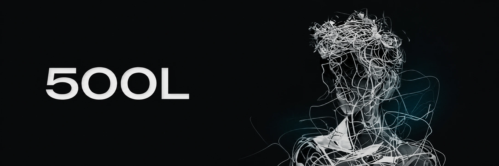

  <picture>
    <source media="(max-width: 600px)" srcset="./assets/header-mobile.webp" />
    
  </picture>

# 500L

独立开发者。目前主要在做私有项目 **newwei**，以及开源项目 **[nini](https://github.com/wei500L/nini)**。

---

## 01 — NEWWEI

PRIVATE FLAGSHIP

面向组织的全球态势感知与新闻情报分析系统。它将多源新闻和事件数据整理为可查询、可解释、可持续运营的情报资产。

**System path** 
`INGEST → CLEAN → STRUCTURE → CONNECT → RETRIEVE → EXPLAIN → ALERT`

**Architecture** 
4 runtime applications · 5 shared packages · modular monolith · REST / GraphQL / WebSocket

**Stack** 
Next.js 15 · React 19 · NestJS 11 · Prisma · MongoDB · Redis · Qdrant · BullMQ · Three.js · LiteLLM

采集、知识图谱、影响链分析、向量检索、实时信号与运营控制台共同组成完整生产链路。仓库保持私有，因此这里不提供无效的公开链接。

---

## 02 — [NINI](https://github.com/wei500L/nini)

OPEN-SOURCE LAB

一个本地优先的多智能体采访训练系统，用真实公开来源生成采访场景，并在采访过程中提供实时导播、语音转录和可追溯复盘。

- **Grounded** — Tavily MCP 检索真实来源，Writer / Critic 与代码门禁阻止无来源内容进入训练。
- **Live** — DeepSeek 通过 SSE 流式返回；Director 提供经过防泄漏检查的实时耳返。
- **Local-first** — Whisper 在本机完成中文转录，SQLite 保存跨场次能力画像。
- **Auditable** — 客观指标由代码计算，语义评分引用真实回合证据。

[Repository](https://github.com/wei500L/nini) · [Interview sequence](https://github.com/wei500L/nini/blob/main/newsroom/docs/sequence.md) · [Memory design](https://github.com/wei500L/nini/blob/main/newsroom/docs/memory-design.md) · [Speech pipeline](https://github.com/wei500L/nini/blob/main/newsroom/docs/speech-design.md)

DeepSeek · Tavily MCP · Whisper · FastAPI · React · TypeScript · SSE · SQLite

---

## Selected codebase

<table width="100%">
  <tr>
    <td align="center" width="33%"><strong>555,552</strong> physical source lines</td>
    <td align="center" width="33%"><strong>1,932</strong> source files</td>
    <td align="center" width="33%"><strong>2</strong> allowlisted codebases</td>
  </tr>
</table>

  2026.07 snapshot · newwei + nini only · no forks · generated code, docs, assets, build output, vendors and lockfiles excluded

---

## Contributions

  

  
Contribution snake

   
  

    <picture>
      <source media="(prefers-color-scheme: dark)" srcset="https://raw.githubusercontent.com/wei500L/wei500L/output/github-snake-dark.svg" />
      <source media="(prefers-color-scheme: light)" srcset="https://raw.githubusercontent.com/wei500L/wei500L/output/github-snake.svg" />
      
    </picture>
  

Metrics refresh daily · Asia/Shanghai

